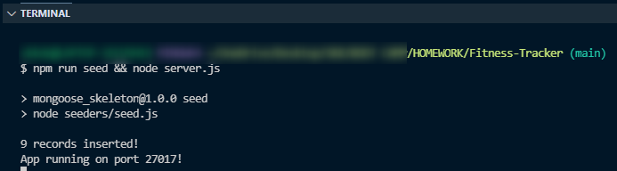
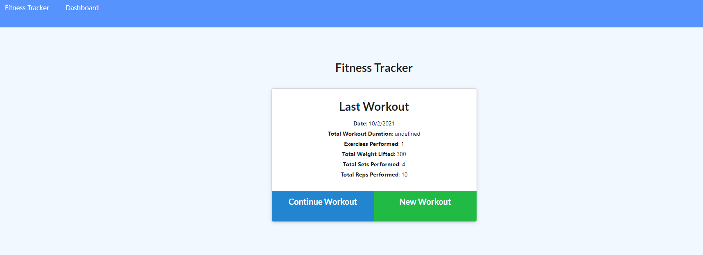
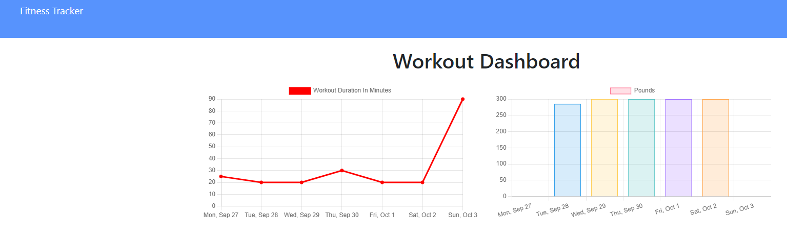

# Fitness-Tracker

Connecting the database locally to create an interactive fitness tracker.The frontend code was included, adding schemas and routes are needed to complete the tracker.

## User Story

> The user should be able to create and track daily workouts for both cardio and resistance exercises.The tracking includes: name, type, weight, sets, reps, and duration of exercise.

## Acceptance Criteria

>When the user loads the page, they will be given the following options:

* Add new exercises to their current workout.

* Create a new workout.

* View the combined weight of multiple exercises from the past seven workouts on the `stats` page.

* View the total duration of each workout from the past seven workouts on the `stats` page.

## Startup

## Mock-up

## Installation

* MongoDB
* Mongoose
* Express
* NPM
* Video to markdown!

## Links

Github: <https://github.com/SarahKubik/Fitness-Tracker.git>

Heroku: <https://calorieburner.herokuapp.com/>
